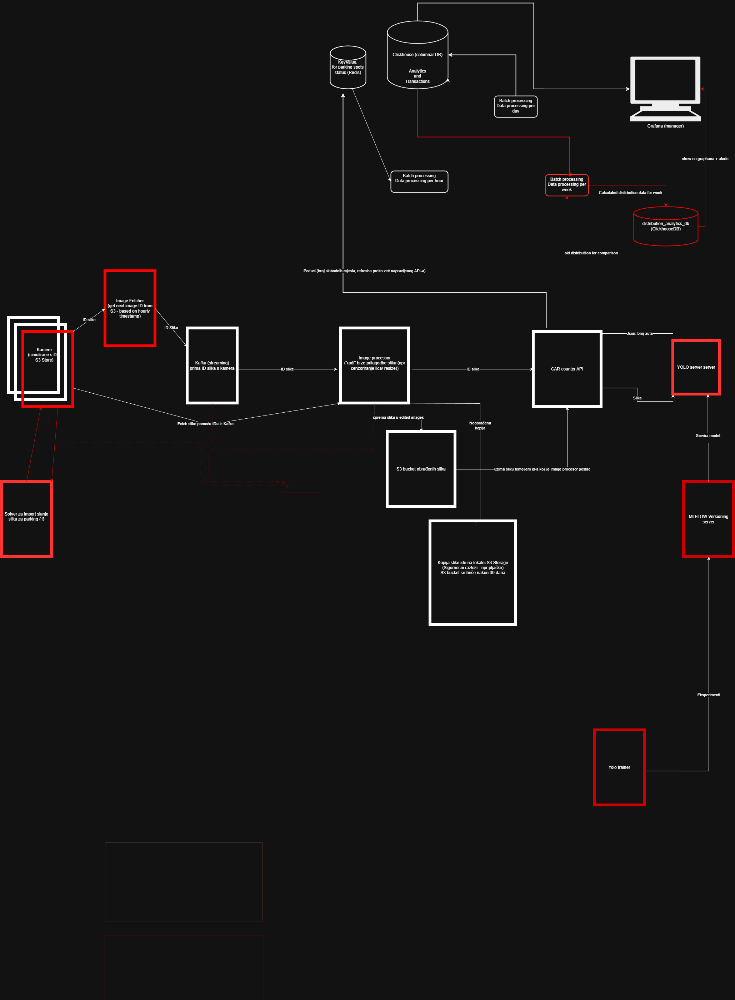

# ParkMan - MLOps Pipeline (Phase 5)

**Autori:** Benjamin Jakupović i Damjan Đekić

**Kontekst:** Projekt iz kolegija *Inteligentni informacijski sutavi*

**Ak. god.:** 2025./2026.

**Verzija dokumentacije:** v1

## 1. Uvod

### 1.1. Svrha dokumenta

U ovom dokumentu se prikazuje tehnička dokumentacija nadogradnje sustava Parkman.

### 1.2. Nadogradnja

U ovoj nadogradnji sustava ParkMan, cilj je bio proširiti postojeće funkcionalnosti sustava dodavanjem:
- sustava za verzioniranje modela (MLFlow), što olakšava postupak praćenja eksperimenata i postavljanje modela računalnog vida.
- praćenja prosječne distribucije korištenosti parkinga kroz vrijeme, kako bi se osiguralo pravovremeno upozoravanje vlasnika na nedosljednosti u zauzetosti parkinga.

### 1.2. Povezana dokukentacija
Na sljedećoj poveznici je detaljnija dokumentacija projekta ParkMan:
    - [Onedrive](https://uniri-my.sharepoint.com/:b:/g/personal/benjamin_jakupovic_uniri_hr1/IQBxKCiG_vY7TqhrMb42BgwBATg140KsFKUupPaZixg55SY?e=DsJmTs)

## 2. Pregled MLOps arhitekture

Ovo poglavlje opisuje MLOps arhitekturu uvedenu u fazi 5 projekta ParkMan, s fokusom na infrastrukturu, tok podataka i integraciju strojnog učenja u produkcijski pipeline. Arhitektura je dizajnirana kao event-driven mikroservisni sustav, u kojem se pomoću message brokera prosljeđuju podaci (slike) modelu (serviranom i verzioniranom pomoću mlflow-a), koji izvršava inferenciju te se sa batch procesima osigurava spremanje rezultata inferencije za daljnju analitiku.

### 2.1. High level arhitektura



Na visokoj razini, MLOps arhitektura sastoji se od sljedećih glavnih komponenti:
1. **Image Fetcher**
    - Servis zadužen za vremenski kontroliran dohvat slika iz dataseta (jedna slika po satu u stvarnom svijetu, odnosno jedna slika na dvije sekunde prilikom testiranja), uz osiguravanje konzistentnog redoslijeda obrade (sekventno po vremenu). Ovaj servis simulira kameru na parkingu koja svakih sat vremena prosljeđuje sliku modelu kako bi za taj parking se odredio broj parkiranih vozila 
2. **Image Processor**
    - Provodi prostornu normalizaciju ulaznih slika (izrezivanje parking zone) kako bi se YOLO modelu isporučivao samo relevantan dio slike. Model tu (obrađenu) sliku sprema u **S3 bucket** s dodatnim transformacijama (kreirajući potencijalni, obrađeni dataset za dotreniravanje modela, uz napomenu da transformacije nisu implementirane) i istovremeno prosljeđuje **Car counter-u** sliku za detekciju. Također sprema neobrađenu kopiju slike u sigurni **S3 bucket** za taj parking, kojem jedino vlasnik tog parkinga ima pristup. Taj bucket ima retention policy od 30 dana.
3. **YOLO Inference Server (Car Counter)**
    - Lokalni servis za inferenciju koji prima obrađene slike iz **image processor-a** i vraća broj detektiranih vozila. Servis učitava model sa MLflow registry-a (model koji je označen kao **production**).
    - Ovaj mikroservis je podijeljen na dva dijela:
        - **Car Counter**, servis koji prima slike obrađene slike koje **image processor** proslijedi, poziva api **YOLO Server-a** za inferenciju i dobiva broj vozila za parking. Taj broj vozila se zapisuje u **Redis** bazu, mijenjajući prethodni zapis za taj parking u **Redisu**.
        - **YOLO server** mikroservis koji učitava odgovarajući model s MlFLow-a (označen kao **production**) te izlaže endpoint za inferenciju modela pomoću FastAPI aplikacije.

4. **MLflow Server**
    - Služi kao registar modela i izvor istine za verzije modela korištene u inferenciji. U MLFlow-u su se zapisivali rezultati treniranja modela (metrike tijekom treniranja, parametri modela, konfiguracijske datoteke korištenog skupa podataka, artefakti stvoreni tijekom treniranja modela te konačne težine modela). Trenirani modeli su se registrirali u mlflowu te su se dodale odgovarajue oznake (npr. oznaka **production**), kako bi se mogao definirati model koji će drugi mikroservisi preuzeti.

5. **MinIO (S3 Storage)**
    - Služi kao pohrana za slike s parking kamera te uključuje pohranu "raw" slika (za simulaciju rada parking kamere), pohranu obrađenih slika (npr. Area of interest extraction) koje se prosljeđuju modelu, pohranu obrađenih slika za dotreniravanje modela te pohranu neobrađenih slika parkinga za sigurnosne potrebe.

6. **Redis**
    - Baza podataka za svaki parking sprema trenutno stanje auta na parkingu te timestamp ažuriranja tog unosa, kako bi se mogao pratiti redoslijed slika koje će **Image fetcher** proslijediti modelu iz pohrane za simulaciju rada parking kamere.

7. **ClickHouseDB**
    - Baza podataka koja se koristi za potrebe analitike korištenosti parkinga. (prosjeci distribucija zauzetosti parkinga po danima u tjednu i detekcija odstupanja te praćenje korištenosti parkinga kroz vrijeme)

8. **Prometheus**
    - Servis za praćenje rada sustava (baze, etl servisi) te spremanje varijable koja se koristi za ažuriranje alarma za nedosljednost u distribuciji korištenja parkinga.
9. **Grafana**
    - Servis koji vlasniku parkinga omogućuje praćenje metrika parkinga (korištenost parkinga kroz vrijeme, prosječna distribucija korištenosti te praćenje alarma o nedosljednosti).
10. **ETL servisi**
    - Batch servisi koji su ključni za analitiku:
        - **Parking usage** servis, koji svakih sat vremena (neposredno nakon što model ažurira unos u Redisu), preuzima trenutno stanje za parkinge u Redisu te ih sprema u **ClickhouseDB** radi praćenja povijesti korištenosti tog parkinga
        - **Weekly parking distribution** servis, koji svakih tjedan dana preuzima povijest parkinga iz **ClickhouseDB**, izračunava prosječnu zauzetost parkinga po satu (tijekom svih 7 dana) te sprema novu tjednu distribuciju u **ClickhouseDB**. Ovaj servis također uspoređuje prethodnu prosječnu zauzetost parkinga te temeljem uspredbe distribucija (preko apsolutne razlike, relativne razlike i Z-testa) definira postoji li odstupanje između nove i prethodne distribucije. U slučaju da postoji, postavlja se alarm u **Prometheusu** te se promjena prikazuje u **Grafani**.
11. **Kafka**:
    - Message broker koji se koristi za stremaning slika između **S3 storage-a** i **image processor-a**

Komponente su orkestrirane putem Docker infrastrukture, dok se komunikacija između servisa temelji na jasnoj podjeli odgovornosti i minimalnoj međuzavisnosti.

### 2.2. Event & data flow
MLOps pipeline u fazi 5 slijedi deterministički i ponovljiv tok podataka, prikazan u nastavku:
1. **Vremenski dohvat slike**
    - Image Fetcher simulira kameru koja uzima sliku parkinga, tako da dohvaća sliku iz MinIO Storage-a na temelju timestamp-a (jedna slika po satu), pri čemu koristi Redis kako bi osigurao da se slike ne obrađuju više puta.
2. **Pohrana i prosljeđivanje**
    - Dohvaćena slike ostaje pohranjena u MinIO-u, a metapodaci o slici (ključ, timestamp, parking ID) prosljeđuju se sljedećem servisu (Kafka).
3. **Prostorna normalizacija**
    - Image Processor prima metapodatke iz Kafke, preuzima sliku iz S3 storage-a, izdvaja relevantni dio slike (ROI) koji sadrži parkiralište te:
        - sprema sigurnosnu kopiju originalne slike
        - sprema "obrađenu" kopiju slike za potrebe dotreniranja modela
        - generira procesiranu verziju slike za inferenciju
4. **YOLO inferencija**
    - Procesirana slika šalje se lokalnom YOLO serveru, koji koristi model dohvaćen iz MLflow registry-a za detekciju i prebrojavanje vozila
5. **Spremanje rezultata**
    - Rezultati inferencije (broj vozila po slici) zapisuju se u:
        - Redis (trenutno stanje)
        - ClickHouseDB (za kasniju analizu) pomoću batch servisa
6. **Batch obrada (periodički)**
    - Na tjednoj bazi izračunavaju se agregirane distribucije zauzeća parkirališta, koje se uspoređuju s prethodnim periodima radi detekcija anomalija

## 3. Image Fetcher - vremenski kontroliran ingestion

### 3.1. Uloga Image Fetcher-a u MLOps pipeline-u
Image Fetcher je servis koji periodički (svaki puni sat) dohvaća sljedeću sliku iz MinIO/S3 bucket-a na temelju timestamp-a iz naziva ključa (S3 key). Odabranu slikku ne preuzima lokalno, već šalje metapodatke (key + parking_lot_id) kroz Kafka topic prema sljedećoj komponenti pipeline-a (Image Processor). Osnovna ideja servisa je da, umjesto nasumičnog uzimanja slike kao prije, osigurava deterministički i reproducibilni redoslijed obrade.

### 3.2. Odgovornosti i granice servisa
Image Fetcher izvodi sljedeće radnje:
- Resolve-a `parking_lot_id` iz MongoDB-a (prema imenu parkinga)
- Lista objekte u MinIO bucket-u
- Parsira timestamp iz naziva ključa (regex uz više različitih formata)
- Bira sljedeći ključ (`ts > last_ts`)
- Šalje Kafka poruku: `{image_key, parking_lot_id}`
- Sprema stanje u Redis (`last_ts`, `last_key`)
- Spava do sljedećeg punog sata

### 3.3. Konfiguracija (environment varijable)
Najvažnije varijable okruženja za Image Fetcher su:
**MinIO/S3**
- `MINIO_ENDPOINT` (npr. `http://minio:9901`)
- `MINIO_ACCESS_KEY`, `MINIO_SECRET_KEY` (pristup MinIO)
- `BUCKET_CAMERA` (bucket s dataset slikama)

**Kafka**
- `KAFKA_BOOTSTRAP` (Kafka URL)
- `TOPIC` (tema na koju se pretplaćuje)

**Redis**
- `REDIS_HOST` (Redis URL)
- `REDIS_PORT`

**MongoDB (parking_lot_id resolve)**
- `MONGO_MANAGER_DATABASE_R_ONLY_URI` (čitanje podataka o parkingu)
- `PARKING_LOT_NAME` (ime parkinga koje se dohvaća)
- `MONGO_LOTS_COLLECTION` (skup parkinga)

**Scheduler**
- `FETCH_INTERVAL_SECONDS`
    - `0` = spavanje do sljedećeg punog sata
    - `>0` = spavanje x broj sekundi

### 3.4. Startup: resolve parking_lot_id iz MongoDB
Na startu servis resolve-a parking_lot_id na temelju imena parkinga. Dizajnirano je na način da radi samo sa jednim parkingom

```python
def resolve_parking_lot_id() -> str:
    if not MONGO_URI:
        raise RuntimeError("Missing MONGO_MANAGER_DATABASE_R_ONLY_URI")

    client = MongoClient(MONGO_URI)
    try:
        db = client.get_default_database()
        col = db[MONGO_LOTS_COLLECTION]

        if PARKING_LOT_NAME_REGEX:
            q = {"name": {"$regex": PARKING_LOT_NAME, "$options": "i"}}
        else:
            q = {"name": PARKING_LOT_NAME}

        doc = col.find_one(q, {"_id": 1, "name": 1})
        if not doc:
            raise RuntimeError(f"Parking lot not found. Query={q}")

        return str(doc["_id"])
    finally:
        client.close()
```

### 3.5. Parsiranje timestamp-a iz S3 key-a
Fetcher pretpostavlja da timestamp postoji u nazivu objekta (ključu). Podržano je više formata preko regex uzorka, npr.:
- `YYYY-MM-DD HH:MM:SS`
- `YYYYMMDDHHMMSS`
- `YYYY/MM/DD/HH/MM/SS`

Parsiranje vraća `datetime` u UTC formatu:
```python
def parse_ts_from_key(key: str) -> Optional[datetime]:
    for pattern in TS_PATTERNS:
        m = pattern.search(key)
        if not m:
            continue
        return datetime(y, mo, d, h, mi, s, tzinfo=timezone.utc)
    return None
```

Ako key nema parsabilan timestamp, taj objekt se ignorira i ne ulazi u izbor.

### 3.6. Redis state: last_ts i last_key
Da bi se izbjegla ponovna obrada istih slika, state se drži u Redis-u kroz dva ključa:
- `image_fetcher:last_ts`
- `image_fetcher:last_key`

```python
def get_last_state(r: redis.Redis) -> Tuple[Optional[datetime], Optional[str]]:
    last_ts_raw = r.get(REDIS_KEY_LAST_TS)
    last_key_raw = r.get(REDIS_KEY_LAST_KEY)

def set_last_state(r: redis.Redis, ts: datetime, key: str) -> None:
    r.set(REDIS_KEY_LAST_TS, ts.isoformat())
    r.set(REDIS_KEY_LAST_KEY, key)
```

Deterministički izbor sljedeće slike omogućava `last_ts`, dok se `last_key` koristi za debugging i praćenje zadnje poslanih slika.

### 3.7. Odabir sljedeće slike
Fetcher lista objekte u bucketu (maksimalno do veličine definirane sa `S3_MAX_KEYS_SCAN`, default 5000), parsira timestamp, sortira i bira:
- ako `last_ts` ne postoji uzima se najranija slika
- inače traži prvi `ts > last_ts`
- ako nema novijih i varijable `WRAP_AROUND_TO_START=true`, vraća se natrag na početak

```python
def pick_next_key_by_timestamp(keys: List[str], last_ts: Optional[datetime]) -> Optional[Tuple[str, datetime]]:
    parsed = [(ts, k) for k in keys if (ts := parse_ts_from_key(k)) is not None]
    parsed.sort(key=lambda x: x[0])

    if last_ts is None:
        ts, k = parsed[0]
        return (k, ts)

    for ts, k in parsed:
        if ts > last_ts:
            return (k, ts)

    if WRAP_AROUND_TO_START:
        ts, k = parsed[0]
        return (k, ts)

    return None
```

### 3.8. Kafka poruka
Kada se odabere slika, šalje se poruka na Kafka topic. Payload je minimalan:
```python
payload = {
    "image_key": next_key,
    "parking_lot_id": parking_lot_id,
}
producer.send(KAFKA_TOPIC, value=payload)
producer.flush()
```

### 3.9. Scheduler
Fetcher ima dva režima.

**Produkcijski režim (default)**
- Spava do sljedećeg punog sata
```python
now = datetime.utcnow()
next_hour = (now + timedelta(hours=1)).replace(minute=0, second=0, microsecond=0)
time.sleep((next_hour - now).total_seconds())
```

**Test režim**
- Ako je ``FETCH_INTERVAL_SECONDS > 0, koristi se fiksni sleep u sekundama
```python
if FETCH_INTERVAL_SECONDS > 0:
    time.sleep(FETCH_INTERVAL_SECONDS)
```

## 4. Image Processor - prostorna normalizacija input-a
Image Processor je servis koji se nalazi između Image Fetcher-a i YOLO inferencijskog servisa. Njegova primarna uloga je prostorna normalizacija slika, odnosno izdvajanje samo onog dijela slike koji zaista sadrži parkiralište (ROI - *Region of interest*).

Time se smanjuje šum u ulaznim podacima, povećava konzistentnost inferencije i pojednostavljuje rad YOLO modela.

### 4.1. Uloga Image Processor u MLOps pipeline-u
Image Processor predstavlja klasičan preprocessing korak u MLOps arhitekturi.
- Dohvaća originalnu sliku in MinIO-a (prema `image_key`)
- Izdvaja statički definirani ROI (parkiralište)
- Sprema:
    - originalnu sliku u security bucket
    - procesiranu (izrezanu) sliku u output bucket
- Prosljeđuje procesiranu sliku YOLO inferencijskom servisu

### 4.2. Problem koji Image Processor rješava
Dataset korišten u ovoj fazi projekta ima sljedeća svojstva:
- Kamera je statična
- Parkiralište se uvijek nalazi na donjem desnom dijelu slike
- Ostatak slike sadrži:
    - zgrade
    - cestu
    - nebo
    - šum koji nije relevantan za detekciju vozila na parkiralištu

Ako bi se cijela slika slala u YOLO model:
- povećava se broj lažnih detekcija
- model uči irelevantne obrasce
- inferencija je sporija i nestabilnija

Zbog toga je uveden Image Processor koji garantira da YOLO uvijek dobiva prostorno konzistentan input.

### 4.3. Strategija izdvajanja ROI-ja
U ovoj fazi koristi se statički ROI, definiran u odnosu na dimenzije slike.

ROI je:
- Pozicioniran u donjem desnom kutu slike
- Definiran kao postotak širine i visine slike
- Ne ovisi o detekciji (nema dinamičkog ROI-ja)

Razlozi zašto je korišten statički ROI:
- Kamera je fiksna
- Dataset je konzistentan
- Implementacija je jednostavna i deterministička

### 4.4. Dohvat slike iz MinIO-a
Image Processor prima poruku koja sadrži `image_key`. Na temelju toga dohvaća originalnu sliku iz MinIO bucket-a.
```pyhton
obj = s3.get_object(Bucket=BUCKET_CAMERA, Key=image_key)
image_bytes = obj["Body"].read()
image = cv2.imdecode(np.frombuffer(image_bytes, np.uint8), cv2.IMREAD_COLOR)
```

Ako slika ne postoji ili se ne može dekodirati:
- Proces se prekida
- Greška se zapisuje
- Slika se ne šalje dalje u pipeline

### 4.5. Izračun ROI-ja i rezanje slike
ROI se računa dinamički iz dimenzija slike, ali s fiksnim omjerima:
```python
h, w, _ = image.shape

x_start = int(w * 0.55)
y_start = int(h * 0.55)

roi = image[y_start:h, x_start:w]
```

Ovim pristupom:
- Gornji lijevi dio slike se odbacuje
- Zadržava se donji desni kvadrant slike
- Crop radi ispravno za različite rezolucije

### 4.6. Pohrana originalne i procesirane slike
Nakon obrade, Image Processor sprema dvije verzije slike

#### 1. Originalna slika (sigurnosna kopija)
- Služi za:
    - sigurnosne potrebe (ako se na primjer snime ključni dokađaji na parkingu vlasnika)
- Sprema se u poseban bucket
```python
s3.put_object(
    Bucket=SECURITY_BUCKET,
    Key=image_key,
    Body=image_bytes,
    ContentType="image/jpeg"
)
```

#### 2. Procesirana slika (ROI)
- Koristi se isključivo za inferenciju
- Manja je
- Sadrži samo relevantne informacije
```python
_, encoded = cv2.imencode(".jpg", roi)
s3.put_object(
    Bucket=PROCESSED_BUCKET,
    Key=image_key,
    Body=encoded.tobytes(),
    ContentType="image/jpeg"
)
```

### 4.7. Prosljeđivanje slike YOLO inferenciji
Nakon uspješne obrade, Image Processor šalje procesiranu sliku YOLO serveru.

Ovim se Image Processor logički odvaja od inferencije, što je važno MLOps načelo.

### 4.8. Konfiguracija Image Processor-a
Najvažnije varijable okoline:
- `BUCKET_CAMERA` (MinIO bucket sa slikama kamere)
- `BUCKET_SECURITY` (Security storage originalnih slika)
- `BUCKET_PROCESSED` (Pohrana procesiranih slika)
- `ROI_X_START_RATIO` (Postotak slike koji se reže vodoravno)
- `ROI_Y_START_RATIO` (Postotak slike koji se reže okomito)

Omjeri ROI-ja mogu se prilagoditi bez promjene koda.

## 5. YOLO Inference servis (lokalni server)

### 5.1. Razlozi za lokalni YOLO server

### 5.2. API YOLO servera

### 5.3. Integracija s Car Counter servisom

## 6. MLflow integracija

### 7.1. Uloga MLflow-a u sustavu

### 7.2. Dohvat "najboljeg" modela

### 7.3. Odvajanje treniranja i 

## 8. Batch processing i ClickHouseDB

### 8.1. Razlozi za batch obradu
- tjedne distribucije
- trendovi zauzeća parkinga

### 8.2. Nova ClickHouse baza

### 8.3. Tjedna average distribucija
- dohvat stare distribucije
- računanje nove
- usporedba i spremanje nove
- alert ako postoji odstupanje

## 9. Dataset management i kontrolirani fault injection
U ovoj fazi projekta poseban je naglasak stavljen na upravljanje dataset-om i testiranje ponašanja MLOps pipeline-a u prisutnosti anomalnih ulaznih podataka. U tu svrhu uvedeni su:
- kontrolirano kreiran dataset
- pomoćni servis Bad Image Injector za simulaciju anomalija

Cilj ovog projekta je pokazati da MLOps pipeline nije testiran samo na "idealnim" podacima, već i na namjerno narušenim scenarijima.

### 9.1. Kreiranje novog dataset-a
- TODO: molio bih te da ti ovdje malo raspišeš kako si scrape-ao podatke da ja ne bih pisao gluposti napamet

### 9.2. Motivacija za uvođenje Bad Image Injector-a
U realnim sustavima za nadzor parkirališta, ulazni podaci često odstupaju od očekivanog obrasca. Mogu se pojaviti:
- slike praznog parkirališta u neuobičajeno vrijeme
- slike s ekstremnim brojem vozila
- slike koje ne odgovaraju prostornoj strukturi dataseta
- slike koje narušavaju povijesnu distribuciju zauzeća

Ako se pipeline testira isključivo na "čistom" dataset-u:
- sustav može djelovati stabilno
- batch analiza neće otkriti slabosti
- anomalije se neće manifestirati u metrikama

Zbog tog razloga uveden je Bad Image Injector koji omogućuje kontrolirano i reproducibilno narušavanje dataset-a bez promjene u glavnom pipeline-u.

### 9.3. Uloga Bad Image Injector-a u arhitekturi
Bad Image Injector je pomoćni servis koji:
- ne sudjeluje u redovnom inference toku
- ne komunicira s YOLO servisom
- ne mijenja logiku Image Fetcher-a i Image Processor-a

Njegova zadaća je ubacivanje anomalnih slika u dataset na način koji je u potpunosti transparentan ostatku sustava. Time se ponaša kao generalni izvor grešaka, a ne kao workaround ili debug alat.

### 9.4. Način rada
Bad Image Injector radi u sljedećim koracima:
1. Dohvaća postojeće slike iz MinIO storage-a
2. Odabire ciljani timestamp za injekciju (trenutno vrijeme ili ručno definirano)
3. Priprema anomalne slike
4. Sprema slike u isti bucket s modificiranim key-em
5. Slika postaje dio regularnog ingestion reda

### 9.5. Odabir ciljanog timestamp-a
Bad Image Injector koristi timestamp-based sustav imenovanja kako bi se:
- anomalna slika pojavila točno u željenom trenutku
- osiguralo da Image Fetvher obradi sliku u predviđenom redoslijedu

Primjeri scenarija:
- injekcija anomalije odmah nakon zadnje "normalne" slike
- ubacivanje anomalije usred tjednog intervala
- simulacija naglog skoska u zauzeću parkinga

Ovaj pristup omogućuje preciznu kontrolu nad eksperimentom.

### 9.6. Implementacija: injekcija slike u MinIO
Bad Image Injector direktno komunicira s MinIO/S3 storage-om. Injekcija se svodi na spremanje nove slike s validnik key-em:
```python
s3.put_object(
    Bucket=BUCKET_CAMERA,
    Key=target_key,
    Body=image_bytes,
    ContentType="image/jpeg"
)
```

Budući da se koristi isti bucket i ista naming konvencija:
- Imaga Fetcher automatski prepoznaje slike
- Nema potrebe za dodatnim flagovima ili metapodacima

### 9.7. Tipovi simuliranih anomalija
U ovoj fazi projekta fokus je na jednostavnim, ali efektivnim anomalijama. Budući da se za YOLO servis uvijek pripremaju slike sa istog parkirališta, Bad Image Injector uzima slike sa drugog parkirališta na kojima u potpunosti ili gotovo nema automobila.

Ovakav slučaj dovoljan je za testiranje:
- batch agregacije
- tjednih distribucija
- usporedbe s povijesnim prosjekom

### 9.8. Uloga Bad Image Injector-a u batch analizi
Anomalne slike koje Bad Image Injector ubacuje:
- prolaze kroz cijeli pipeline
- ulaze u ClickHouseDB
- utječu na tjedne distribucije zauzeća

Time se omogućuje:
- provjera osjetiljivosti batch analize
- validacija detekcije odstupanja
- simulacija realnih "incident" scenarija

## 10. State management i konzistentnost
U MLOps pipeline-u koji obrađuje vremenski organizirane podatke, upravljanje stanjem (state management) predstavlja ključni mehanizam za osiguravanje determinističkog ponašanja, konzistentnosti obrade i izbjegavanje dupliciranja podataka.

State management je u ovom projektu centraliziran pomoću Redis baze, koja služi kao lagana, brza i pouzdana komponenta za dijeljenje stanja između iteracija pipeline-a.

### 10.1. Motivacija za uvođenje state management-a
Bez eksplicitnog upravljanja stanjem, MLOps pipeline bi imao sljedeće probleme:
- ponovna obrada istih slika
- nemogućnost nastavka rada nakon restarta servisa
- nekonzistentni redoslijed obrade
- nemogućnost preciznog batch grupiranja po vremenu

S obzirom na to da se ingestion temelji na timestamp-u, stanje sustava mora sadržavati informaciju o tome koja je zadnja slika obrađena.

### 10.2. Redis kao centralni state store
Redis je odabran kao centralni store stanja zbog sljedećih razloga:
- izuzetno brze operacije čitanja i pisanja
- jedostavna integracija s Python servisima
- in-memory priroda (niska latencija)
- mogućnost jednostavnog resetiranja stanja u eksperimentalnom okruženju

Redis se koristi isključivo za state, a ne za pohranu rezultata ili podataka visoke trajnosti.

### 10.3. Ključevi stanja u sustavu
Implementirani su sljedeći ključevi:
- `image_fetcher:last_ts`
    - timestamp zadnje uspješno poslane slike
- `image_fetcher:last_key`
    - S3 key zadnje poslane slike (debug ili audit svrhe)

Ovi ključevi predstavljaju minimalni, ali dovoljan state potreban za determinističko ponašanje pipeline-a.

### 10.4. Korištenje state-a u Image Fetcher-u
Image Fetcher koristi Redis state u svakom ciklusu rada:
1. Čita `last_ts` i `last_key`
2. Lista objekte u MinIO bucket-u
3. Parsira timestamp iz ključeva
4. Bira prvu sliku za koju vrijedi `ts > last_ts`
5. Šalje Kafka poruku
6. Ako je poruka uspješno poslana, ažurira Redis state
```python
last_ts, last_key = get_last_state(redis_client)

next_key, next_ts = pick_next_key_by_timestamp(keys, last_ts)

producer.send(TOPIC, payload)
producer.flush()

set_last_state(redis_client, next_ts, next_key)
```

Ovim redoslijedom osigurava se da:
- state ne ode ispred stvarne obrade
- ne dolazi do preskakanja slika

### 10.5. Konzistentnost kroz ponovna pokretanja i padove servisa
Jedna od važnih prednosti Redis-based state management-a je otpornost na restart servisa.

Scenarij:
- Image Fetcher se zaustavi (crash, redeploy)
- Redis ostaje aktivan
- Nakon ponovnog pokretanja:
    - Fetcher čita `last_ts`
    - nastavlja obradu od sljedeće slike

Na taj način:
- nema potrebe za ručnim intervencijama
- pipeline se ponaša predvidljivo
- izbjegava se ponovna obrada već procesiranih podataka

### 10.6. Interakcija state-a s Bad Image Injector-om
Bad Image Injector namjerno ne koristi Redis state, ali ga indirektno iskorištava:
- injektirana slika dobiva validan timestamp
- Image Fetcher je vidi kao regularnu sljedeću sliku
- Redis state se normalno ažurira nakon obrade animalije

## 11. Ogranočenja i poznati trade-off-ovi
Iako MLOps infrastruktura razvijena u fazi 4 projekta ParkMan zadovoljava ciljeve eksperimentalnog okruženja, sustav ima niz svjesno prihvaćenih ograničenja i dizajnerskih trade-off-ova.

Ovo poglavlje opisuje ta ograničenja, razloge iza njih te implikacije na stabilnost, skalabilnost i budući razvoj sustava.

Popis ograničenja i poznatih trade-off-ova:
- Sustav pretpostavlja statičnu poziciju kamere i konzistentan pogled na parkiralište. ROI u Image Processor-u je fiksno definiran relativno na dimenzije slike, što pojednostavljuje obradu, ali ne tolerira promjene kuta ili pozicije kamere.
- Ingestion se temelji na timestamp-u ugrađenom u naziv S3 ključa. Ovaj pristup omogućuje deterministički redoslijed obrade, ali zahtijeva strogo poštivanje naming konvencije dataset-a.
- Image Fetcher u svakom ciklusu lista ograničen broj objekata iz bucket-a i parsira timestamp za svaki ključ. Rješenje je robusno i jednostavno za razumijevanje, ali ne skalira optimalno na vrlo velike dataset-ove.
- Upravljanje stanjem u Redis-u svodi se na minimalni set ključeva (`last_ts`, `last_key`). Time se postiže jednostavnost i reproducibilnost, uz cijenu izostanka granularnog praćenja statusa obrade po slici
- YOLO inferencija se izvodi putem lokalnog inference servera, bez horizontalnog skaliranja. Ovaj pristup smanjuje latenciju i olakšava debugiranje, ali nije prilagođen visoko-opterećenim produkcijskim scenarijima.
- Batch analiza se izvodi periodično, s fokusom na agregirane metrike poput tjednih distribucija zauzeća. Sustav ne reagira u realnom vremenu na anomalije.
- Bad Image Injector koristi ručno definirane anomalije i ne generira kompleksne sintetičke poremećaje. Injektiranje slike ostaju u dataset-u i zahtijevaju ručno uklanjanje ako više nisu potrebne.

Sva navedena ograničenja predstavljaju svjesne dizajnerske odluke prilagođene eksperimentalnoj prirodi projekta te služe kao jasna polazišta za budući razvoj sustava.

## 12. Mogući budući razvoj
U ovom poglavlju naveden je popis mogućih budućih smjerova razvoja projekta.

1. Dinamički ROI i podrška za više kamera
    - Image Processor bi se mogao proširiti dinamičkim određivanjem ROI-ja (npr. na temelju kalibracije kamere ili početne detekcije), čime bi se omogućila podrška za više parkirališta i promjenjive kutove snimanja
2. Automatski retraining modela
    - Batch analiza i povijesni podaci iz ClickHouseDB-a mogu poslužiti kao okidač za automatsko ponovno treniranje YOLO modela u slučaju promjene distribucije podataka
3. Detekcija data i concept drift-a
    - Uvođenje statističkih testova ili modela za drift detection moguće je rano otkriti promjene u ponašanju sustava (npr. sezonalnost ili promjene navika parkiranja)
4. Skaliranje inferencije
    - YOLO inference servis može se prilagoditi horizontalnom skaliranju (npr. više instanci servisa) kako bi sustav mogao podnijeti veći broj ulaznih slika
5. Napredniji fault injection
    - Bad Image Injector može se proširiti generiranjem sintetičkih anomalija (blue, noise, occlusion) kako bi se testirala robusnost modela na realnije poremećaje
6. Kubernetes orkestracija
    - Migracija s Docker Compose okruženja na Kubernetes omogućila bi bolju skalabilnost, upravljanje resusrsima i visoku dostupnost sustava

## 13. Zaključak
U fazi 5 projekta ParMan razvijena je funkcionalna MLOps infrastruktura koja nadograđuje postojeći sustav za detekciju vozila kontroliranim ingestionom podataka, prostornom normalizacijom ulaznih slika i odvojenom inferencijom i batch analizom.

Korištenjem vremenski organiziranog dataset-a, Redis-based state management-a i MLflow registry-ja postignuta je deterministička i reproducibilna obrada podataka, što je temelj svakog ozbiljnog MLOps sustava.

Uvođenje Image Processora i Bad Image Injecotr-a omogućilo je stabilniji rad modela te testiranje ponašanja sustava izvan idealnih scenarije, čime je pipeline validiran i na anomalnim podacima.

Iako sustav ima svjesno prihvaćena ograničenja, ona proizlaze iz eksperimentalne prirode projekta te predstavljaju jasne smjernice za budući razvoj.

Ova faza projekta pokazuje kako se računalni vid može integrirati u širi MLOps kontekst, prelazeći s izolirane model-inferencije prema cjelovitom, skalabilnom i proširivom sustavu

